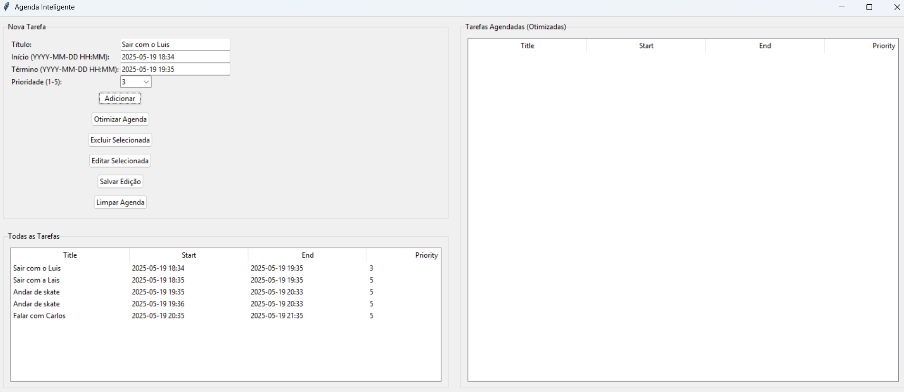
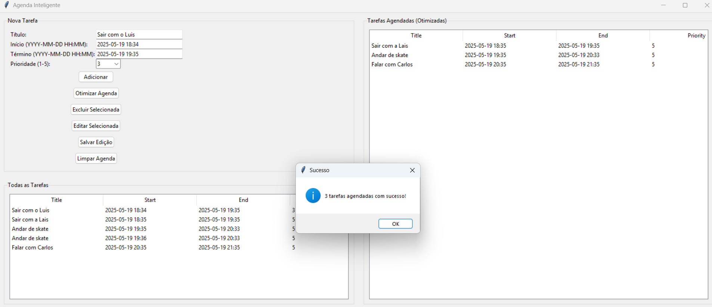
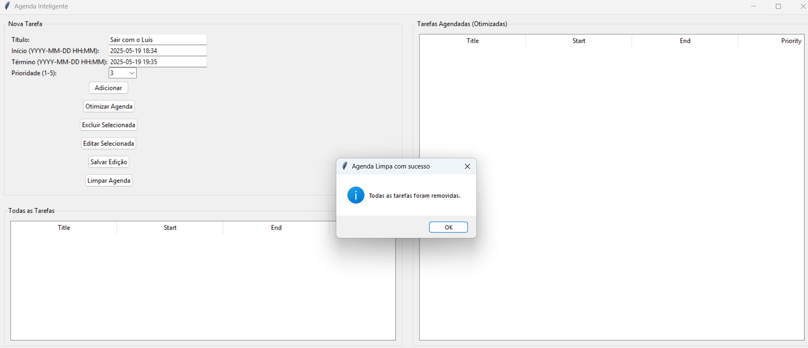

# Greed_agenda

**Número da Lista**: 3 <br>
**Conteúdo da Disciplina**: Greed <br>

## Alunos
|Matrícula | Aluno |
| -- | -- |
| 211042327  |  Carlos Gabriel Cardoso Ramos |
| 202016604  |  João Lucas Miranda de Sousa |

## Sobre
### Agenda Inteligente

Aplicativo de agenda com interface gráfica em Python (Tkinter), que permite cadastrar, visualizar e **otimizar tarefas automaticamente** com base no algoritmo de _Interval Scheduling_.

## Funcionalidades

- Adicionar tarefas com:
  - Título
  - Horário de início e término
  - Prioridade (1 a 5)
- Visualizar todas as tarefas cadastradas
- Otimizar automaticamente as tarefas (selecionar o maior número de tarefas não sobrepostas)
- Excluir tarefas
- Editar tarefas
- Limpar agenda
- Persistência local de dados (`tasks.json`)

## Screenshots




## Algoritmo de Otimização

O botão **"Otimizar Agenda"** aplica o algoritmo **Interval Scheduling**, que seleciona o maior subconjunto de tarefas compatíveis entre si (sem sobreposição), maximizando o aproveitamento do tempo.


## ▶️ Como executar

Siga os passos abaixo para rodar a Agenda Inteligente na sua máquina:

### 1. Clone ou baixe o projeto

Se estiver usando Git:

```bash
git clone https://github.com/projeto-de-algoritmos-2025/Greed_agenda.git
cd Greed_agenda
cd agenda
```


### 2. Verifique se você tem o Python 3 instalado

Execute:

```bash
python3 --version
```

Se não tiver, instale o Python 3 pela [página oficial](https://www.python.org/downloads/).

### 3. Rode o programa

No terminal, dentro da pasta do projeto (agenda):

```bash
python3 main.py
```

A interface gráfica será exibida.

## Outros
[](https://www.youtube.com/watch?v=gYrDXuOqaPE)


